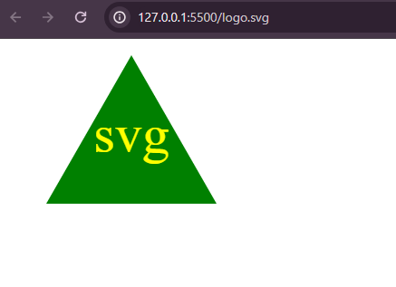

# svglogomaker

## Description 

This application allows users to enter inputs into an inquirer prompt in order to generate a logo file (converts into SVG image).  

## Video Link
<iframe src="https://drive.google.com/file/d/1m8E_45wy3PLBMpSHsJlue_ncrh5jT-7P/preview" width="640" height="480"></iframe>

## Screenshot

